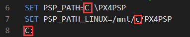

# RFlySimSafev1
RFlySimSafe is an automatic safety test and evaluation platform for UAV autopilot system, based on our previously released high-fidelity HIL simulation 
platform RflySim. RflySimSafe inherits the characteristics of RflySim, uses MATLAB/Simulink as the core programming platform for unmanned system model
design and algorithm development, and uses python as a tool for top-level vision and cluster algorithm development. On this basis, RflysimSafe 
has developed a fault injection interface, introduced open source database software, supports importing drone test cases into the platform, and 
realized fault injection and data analysis throughout the process.

## An example for RFlySimSafe.
A video demonstrating the RFlySimSafe platform by introducing some examples from the paper

## How to use the files.
1. Download and configure the RFlysim platform according to the tutorial of https://rflysim.com/docs/#/en/2_Configuration/SoftwareInstallation
2. Download the source code of RflySimSafe at https://github.com/tujinhu/RflyAutoTest
3. Change the platform path of the RflySimSafe model folder software-in-the-loop and hardware-in-the-loop one-key startup script (RflySimSafe\Model\***\***SITL(HITL).bat): Specifically,

