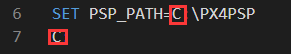

# RFlySimSafev1
RFlySimSafe is an automatic safety test and evaluation platform for UAV autopilot system, based on our previously released high-fidelity HIL simulation 
platform RflySim. RflySimSafe inherits the characteristics of RflySim, uses MATLAB/Simulink as the core programming platform for unmanned system model
design and algorithm development, and uses python as a tool for top-level vision and cluster algorithm development. On this basis, RflysimSafe 
has developed a fault injection interface, introduced open source database software, supports importing drone test cases into the platform, and 
realized fault injection and data analysis throughout the process.

## An example for RFlySimSafe.
A video demonstrating the RFlySimSafe platform by introducing some examples from the paper

## How to use the files.
<ol>
<li>Download and configure the RFlysim platform according to the tutorial of https://rflysim.com/docs/#/en/2_Configuration/SoftwareInstallation</li>
<li>Download the source code of RflySimSafe at https://github.com/tujinhu/RFlySimSafev1</li>
<li>Change the platform path of the RflySimSafe model folder software-in-the-loop and hardware-in-the-loop one-key startup script (RflySimSafe\Model\***\***SITL(HITL).bat): Specifically,Change the path to the path where the RFlySim file(PX4PSP) is located

</li>
<li>Copy the 'Model\***\***.dll' file to the 'PX4PSP\CopterSim\external\model' folder.</li>
<li>Open the RflySimSafe folder and run in the terminal:'pip install -r requirements.txt'.</li>
<li>Open vscode, click File -> Open Folder -> select the RFlySimSafev1 folder</li>
<li>run AutoTestAPI/AutoTest.py</li>
</ol>

##File structure.
AutoTestAPI:This folder is the core of RflySimSafe. specific:
a) AutoMavCmd: control sequence analysis
b) AutoMavCtrl: automatic test environment configuration and task management
c) AutoMavDB: database reading and writing, file data management
d) AutoTest: the main entrance of the automatic test program
e) CameraCtrlApi: visual interface
f) PX4MavCtrlV4: communication interface
g) VisionCaptureApi: visual interface
Data:This folder collects flight data files of different aircraft types. Mainly include log flight log, true value attitude data.
Model:This folder manages the source code of simulink models of quadrotor model.More models will be developed in the future.
Fault.db:The test case database.

## Note
RflySimSafev1 is just a preview, We are working on improving and developing the functions and related documents of the platform. In our future work, we will devote ourselves to developing a more comprehensive test platform and improve the use and configuration documents of the platform. If you are interested in the content of our work, please continue to pay attention to us!
